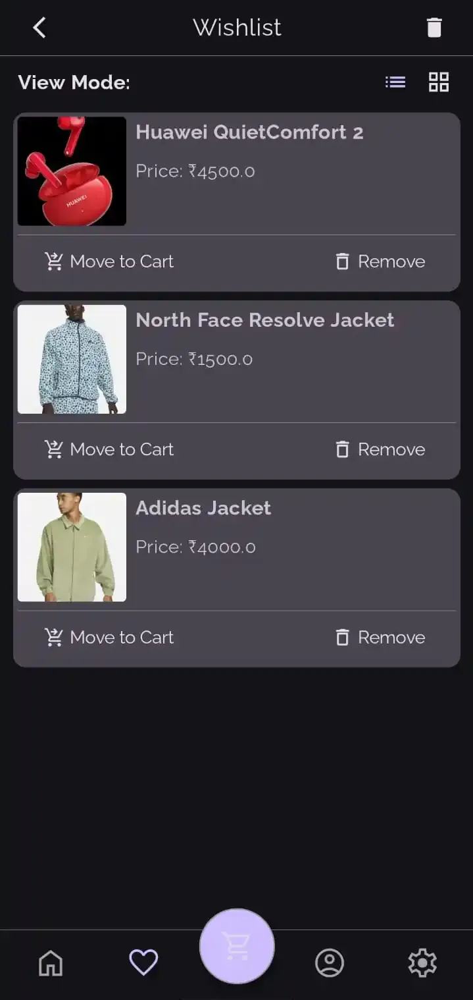

# Thriftr – Peer-to-Peer Marketplace App

## 📌 Overview
Thriftr is a marketplace app for seamless product buying and selling with a responsive and smooth user experience.

## ✨ Features
* **User Authentication**: Secure and responsive user verification and session tracking.
* **Product Listing**: Users can browse and post products for sale.
* **Real-Time Search & Filtering**: Fast search with responsive filtering for a fluid browsing experience.
* **Wishlist & Cart Management**: Includes wishlist with gesture support and real-time cart updates.
* **Optimized Image Handling**: Efficient image caching and loading for better performance.
* **Smooth Animations**: Enhanced UI transitions for a polished user experience.
* **Secure Data Handling**: Backend with debounced network calls and robust security measures.

## 🛠 Technologies Used

- [Coroutines & Flow](https://kotlinlang.org/docs/coroutines-overview.html) – Asynchronous programming for a responsive UI.  
- [Jetpack Compose](https://developer.android.com/compose) – Modern UI toolkit for Android.  
- [Appwrite](https://appwrite.io/) – Backend for authentication, database, and storage.  
- [Dagger Hilt](https://dagger.dev/hilt/) – Dependency Injection.  
- [Coil](https://github.com/coil-kt/coil) – Image loading and caching.  
- [Accompanist](https://google.github.io/accompanist/) – Accompanist components.  
- [Color Picker](https://github.com/skydoves/colorpicker-compose) – Color picker library (by Skydoves).  
- [Konfetti Effect](https://github.com/DanielMartinus/Konfetti) – Confetti effect (by Daniel Martinus).


## 📸 Screenshots

### ☀️ Light Mode

| Register | Home | Sort |
|------|-----------------|------|
|  |  |  |

| Drawer | Wishlist | Checkout |
|------|-----------------|------|
|  |  |  |


### 🌙 Dark Mode

| Start | Add Product | Login |
|------|-----------------|------|
|  |  |  |

| Home | Product Details | Wishlist |
|----------|---------|--------|
|  |  |  |

| Cart | Profile | Edit Profile |
|----------|---------|--------|
|  |  |  |


| Order Confirmation | Orders | Settings |
|----------|---------|--------|
|  |  |  |


## 🎬 Demo

<div align="center" style="position: relative; width: 300px; padding-top: 177.77%; /* 16:9 aspect ratio */">
  <video
    src="https://github.com/user-attachments/assets/c8bfc6d4-63d7-4046-8f46-d71b5597d255"
    style="position: absolute; top: 0; left: 0; width: 100%; height: 100%; object-fit: cover;"
    controls
    playsinline
  ></video>
</div>


## 🚀 Setup Guide

#### 1️⃣ Clone the Repository
```bash
git clone https://github.com/blizzardOfAce/thriftr.git
cd Thriftr
```

#### 🔧 2️⃣ Appwrite Setup:

> **Note**  
> For security and customization purposes, this project does not include Appwrite-related IDs.  
> You’ll need to set up your own Appwrite project and manually copy the required IDs  
> (Project ID, Database ID, Collection IDs, and Bucket IDs) into your `local.properties` file.

---

#### 🚀 Create an Appwrite Project

- Go to [Appwrite Console](https://cloud.appwrite.io) or your self-hosted instance.
- Create a new project (e.g., **"Thriftr"**).
- Get your **Project ID** from the dashboard.

---

#### 🗃️ Create a Database

- Go to **Databases → Create Database** (e.g., **"thriftr-db"**).
- Copy the **Database ID**.

---

#### 🗂️ Create Collections

In your database, create the following collections with appropriate permissions (enable CRUD operations for *All Users* for testing purposes):

##### a. 👤 Users Collection

```
Collection Name: user_collection
Attributes:
- FirstName (String)
- LastName (String)
- Email (Email)
- ImagePath (String)
- SavedAddresses (String[])
- Id (String)
```

##### b. 🛍️ Products Collection

```
Collection Name: product_collection
Attributes:
- id (String)
- name (String)
- category (String)
- price (Double)
- freeShipping (Boolean, default: false)
- stock (Integer, default: 0)
- discount (Double)
- description (String)
- details (String)
- colors (String[])
- sizes (String[])
- images (String[])
```

##### c. 🛒 Cart Collection

```
Collection Name: cart_collection
Attributes:
- userId (String)
- products (String[])
```

##### d. 👍 Wishlist Collection

```
Collection Name: wishlist_collection
Attributes:
- userId (String)
- productId (String)
```

##### e. 📦 Orders Collection

```
Collection Name: order_collection
Attributes:
- orders (String[])
```

---

#### 📁 Create Storage Buckets

Create two storage buckets:

- **Product Images Bucket** (e.g., `"product_images_bucket"`)
- **Profile Images Bucket** (e.g., `"profile_image_bucket"`)

 Enable file read and write access for authenticated users.  
 Copy both **Bucket IDs**.


#### 3️⃣ Configure Local Properties
Create a `local.properties` file in the root directory if it doesn't exist and add all the respective ids:

```properties
APPWRITE_ENDPOINT=https://cloud.appwrite.io/v1
APPWRITE_PROJECT_ID=your_project_id
APPWRITE_DATABASE_ID=your_database_id
APPWRITE_USER_COLLECTION_ID=your_user_collection_id
APPWRITE_PRODUCT_COLLECTION_ID=your_product_collection_id
APPWRITE_CART_COLLECTION_ID=your_cart_collection_id
APPWRITE_WISHLIST_COLLECTION_ID=your_wishlist_collection_id
APPWRITE_ORDER_COLLECTION_ID=your_order_collection_id
APPWRITE_PRODUCT_IMAGE_BUCKET_ID=your_product_image_bucket_id
APPWRITE_PROFILE_IMAGE_BUCKET_ID=your_profile_image_bucket_id
```

#### 4️⃣ Build & Run 🚀
```bash
./gradlew assembleDebug
```

Open the project in Android Studio, connect a device, and run the app! 🎉


## 🗺️ Roadmap
- [ ] Improving animations and transitions
- [ ] Enhanced product management with a dashboard

## 🤝 Contributing
Contributions are welcome! Here's how you can contribute:

1. Fork the repository
2. Create your feature branch (`git checkout -b feature/amazing-feature`)
3. Commit your changes (`git commit -m 'Add some amazing feature'`)
4. Push to the branch (`git push origin feature/amazing-feature`)
5. Open a Pull Request

